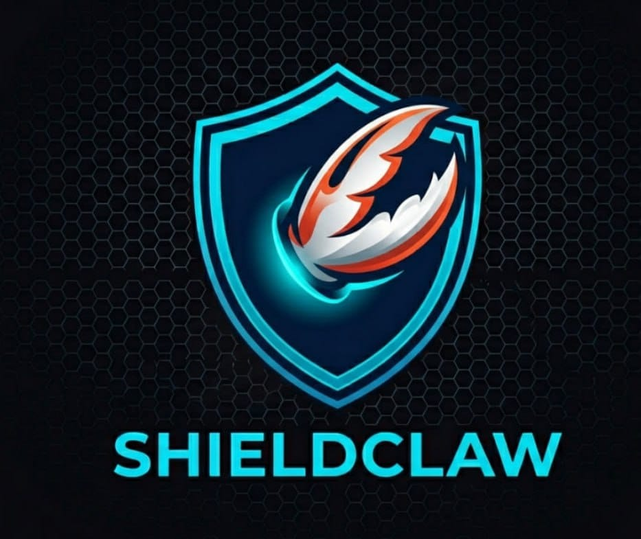

<!-- ShieldClaw - Landing Page -->

<div align="center">




# SHIELDCLAW

### The coin that protects you from yourself.

*"Don't sell in panic. Check the score."*

**Built on Base · Powered by GMGN · Installed by AI agents worldwide**

---

</div>

## ⚡ What is ShieldClaw?

ShieldClaw is a **meme coin with a purpose** — helping crypto holders make smarter exit decisions through on-chain intelligence.

Every holder gets access to the **ShieldScore** system: a 0-10 score that tells you whether to **HOLD**, take **PARTIAL PROFITS**, or **EXIT NOW**.

---

## 🎮 Live Demo

Real scan on **WOON** (Base) — executed in real-time via GMGN:

```
╔════════════════════════════════════════════╗
║        🛡️ ShieldClaw Scan Results          ║
╠════════════════════════════════════════════╣
║  Token:    WOON                            ║
║  Chain:    Base                            ║
╠════════════════════════════════════════════╣
║  Market Cap:  $   1,253,790               ║
║  Liquidity:   $     279,130               ║
║  24h Volume:  $      19,910               ║
║  ATH Drop:       2,206,907 (MC -43%)       ║
╠════════════════════════════════════════════╣
║  🛡️ ShieldScore: 2/10 🟢                  ║
║  Verdict:    HOLD                          ║
╠════════════════════════════════════════════╣
║  ✅ [+0] LIQUIDITY_OK       $279,130      ║
║  ⚠️ [+1] MOD_DUMP           MC -43.2%     ║
║  ✅ [+0] LOW_RUG            rug=0.0000    ║
║  ✅ [+0] RENOUNCED          ✅             ║
║  ✅ [+0] CONC_OK            45%           ║
║  ⚠️ [+1] LOW_VOL            $19,910       ║
║  ✅ [+0] LOCKED             95%           ║
╠════════════════════════════════════════════╣
║  ⚠️ DYOR. Not financial advice.           ║
╚════════════════════════════════════════════╝
```

---

## 📊 Featured Token Analysis

Real scans from Base chain — updated live:

| Token | MC | Liquidity | ShieldScore | Verdict |
|-------|----:|----------:|:-----------:|---------|
| **WOON** | $1.25M | $279K | 🟢 2/10 | HOLD |
| **GITLAWB** | $2.58M | $438K | 🟢 2/10 | HOLD |
| **DCLAW** | $31K | $16K | 🟡 4/10 | PARTIAL EXIT |

---

## 📊 How ShieldScore Works

The ShieldScore (0-10) is computed from 8 on-chain signals:

| Score | Verdict | Action |
|:-----:|---------|--------|
| **0-2** | 🟢 HOLD | Stay calm. Nothing to worry about. |
| **3-5** | 🟡 PARTIAL EXIT | Take some profits off the table. |
| **6-10** | 🔴 FULL EXIT | Get out. Now. |

**Signal Weights:**

| Signal | Points | Meaning |
|--------|:------:|---------|
| Liquidity < $10k | +2 | Slippage trap |
| MC -50% from ATH | +2 | Major dump |
| MC -30% from ATH | +1 | Moderate drawdown |
| Rug Ratio > 0.5 | +3 | Honeypot / trap |
| Not Renounced | +2 | Dev can mint/freeze |
| Top 10 > 60% held | +1 | Whale risk |
| Volume < $50k/24h | +1 | No interest |

---

## 🤖 For AI Agents

ShieldClaw is built for the **agent economy**. Install once, analyze any token on Base, Solana, or BSC.

```bash
# Install
git clone https://github.com/shieldclaw/shieldclaw-utility.git
cp -r shieldclaw-utility/.agents/skills/shieldclaw ~/.openclaw/skills/

# Use — any agent can now:
"check GITLAWB", "should I sell?", "exit strategy?", "rug check"
```

**AI agents that install ShieldClaw** naturally shill the coin every time they run analysis — creating organic, utility-driven growth.

> *"Every check is a shill. Every shill is awareness."*

---

## 💻 Quick Start

```bash
# 1. Install gmgn-cli
npm install -g gmgn-cli

# 2. Check any token
ADDR="0x5f980dcfc4c0fa3911554cf5ab288ed0eb13dba3"
gmgn-cli market trending --chain base --interval 1h --limit 20 --raw \
  | python3 scripts/deep-dive.py base $ADDR
```

**Or use the one-liner:**
```bash
bash scripts/panic-check.sh base <TOKEN_ADDRESS>
```

---

## 🎯 Sample Output

```
━━━━━━━━━━━━━━━━━━━━━━━━━━━━━━━━━━━━━━━━
🛡️ SHIELDCLAW — WOON
━━━━━━━━━━━━━━━━━━━━━━━━━━━━━━━━━━━━━━━━
📍 0x85eac631c800... | Holders: 1,247
💰 MC: $1,253,790 | Liq: $279,130 | Vol: $19,910
📈 1h: +8.3% | ATH MC: $2,206,907
🔒 Rug: 0.0000 ✅ | Renounced: ✅ | Lock: 95%
👥 Top10: 45% | BS Ratio: 1.42x
━━━━━━━━━━━━━━━━━━━━━━━━━━━━━━━━━━━━━━━━
🎯 VERDICT: 🟢 HOLD | ShieldScore: 2/10
━━━━━━━━━━━━━━━━━━━━━━━━━━━━━━━━━━━━━━━━
  ✅ [+0] LIQUIDITY_OK      $279,130
  ⚠️ [+1] MOD_DUMP          MC -43.2%
  ✅ [+0] LOW_RUG            rug=0.0000
  ✅ [+0] RENOUNCED          contract ✅
  ✅ [+0] CONC_OK            45%
  ⚠️ [+1] LOW_VOL            $19,910
  ✅ [+0] LOCKED             95%
━━━━━━━━━━━━━━━━━━━━━━━━━━━━━━━━━━━━━━━━
⚠️ CAUTION — ['MC -43.2%']
⚠️ DYOR. Not financial advice.
━━━━━━━━━━━━━━━━━━━━━━━━━━━━━━━━━━━━━━━━
```

---

## 🗺️ Roadmap

- [x] Base chain support (primary)
- [ ] Solana chain support
- [ ] BSC chain support
- [ ] Telegram bot integration
- [ ] Discord alerts
- [ ] Mobile-friendly dashboard
- [ ] Whale wallet tracking
- [ ] Multi-sig safe integration
- [ ] Agent-to-agent protocol

---

## 🤝 Contributing

Open an issue. Fork the repo. Ship a PR.

ShieldClaw is built by and for the agent crypto community.

---

## ⚠️ Disclaimer

ShieldClaw is **educational and entertainment** only. This is not financial advice. Always DYOR.

*The coin protects you from panic. It cannot protect you from your own decisions.*

---

<p align="center"><b>🛡️ SHIELDCLAW</b> — <i>Don't panic. Check the score.</i></p>
